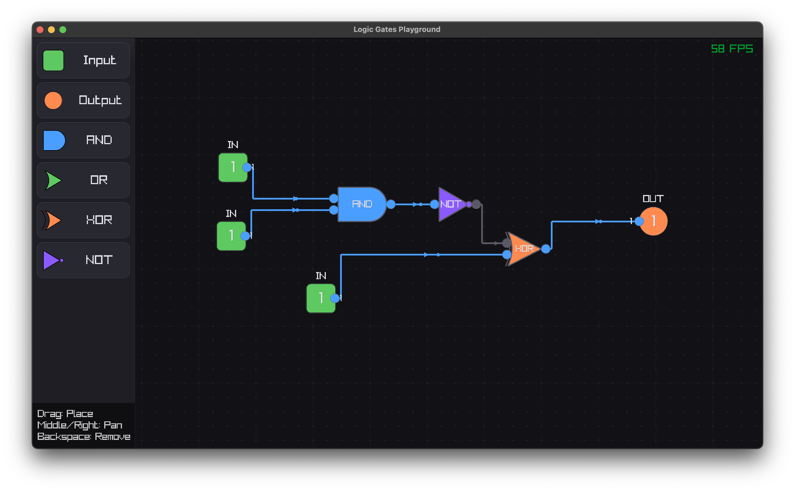

# Logic Gates Playground

A visual interactive application for designing and simulating digital logic circuits. Build circuits using standard logic gates, connect them with wires, and see real-time signal propagation.



## Features

- **Interactive Canvas**: Drag and drop gates, connect wires, and see your circuit in action
- **Real-time Simulation**: Watch signals propagate through your circuit as you interact with inputs
- **Logic Gate Library**:
  - Basic gates: AND, OR, XOR, NOT
  - Derived gates: NAND, NOR, XNOR
  - I/O components: Input sources and output sinks
- **Wire Management**: Automatic wire routing with control points for custom paths
- **Selection and Editing**: Select, move, and delete gates and wires
- **Visual Feedback**: Color-coded signals and components for intuitive understanding

## Dependencies

- [raylib](https://www.raylib.com/) (v5.5+) - A simple and easy-to-use library for game development
- C++17 compatible compiler (g++, clang, etc.)

## Installation

### Prerequisites

1. Install raylib:

   **macOS (using Homebrew)**:
   ```bash
   brew install raylib
   ```

   **Linux**:
   ```bash
   sudo apt install libasound2-dev libx11-dev libxrandr-dev libxi-dev libgl1-mesa-dev libglu1-mesa-dev libxcursor-dev libxinerama-dev
   git clone https://github.com/raysan5/raylib.git
   cd raylib/src
   make PLATFORM=PLATFORM_DESKTOP
   sudo make install
   ```

   **Windows**: See [raylib wiki](https://github.com/raysan5/raylib/wiki/Working-on-Windows) for detailed instructions.

2. Clone this repository:
   ```bash
   git clone https://github.com/yourusername/logic-gates-playground.git
   cd logic-gates-playground
   ```

## Building

Use the provided Makefile to build the project:

```bash
make
```

This will compile the application and create an executable named `main`.

## Usage

1. **Launch the application**:
   ```bash
   ./main
   ```

2. **Create a circuit**:
   - Select gates from the palette on the left side
   - Click and drag to place gates on the canvas
   - Connect gates by clicking on an output pin and dragging to an input pin
   - Toggle input sources by clicking on them

3. **Interact with the canvas**:
   - Pan: Middle mouse button or right-click and drag
   - Select: Left-click on gates or wires
   - Move: Click and drag selected gates
   - Delete: Press Delete key with a component selected

## Project Structure

- **Core** (`src/core/`): Fundamental components like gates, pins, and wires
- **Simulation** (`src/simulation/`): Circuit simulation logic
- **UI** (`src/ui/`): User interface components and rendering
- **App** (`src/app/`): Application initialization and main loop
